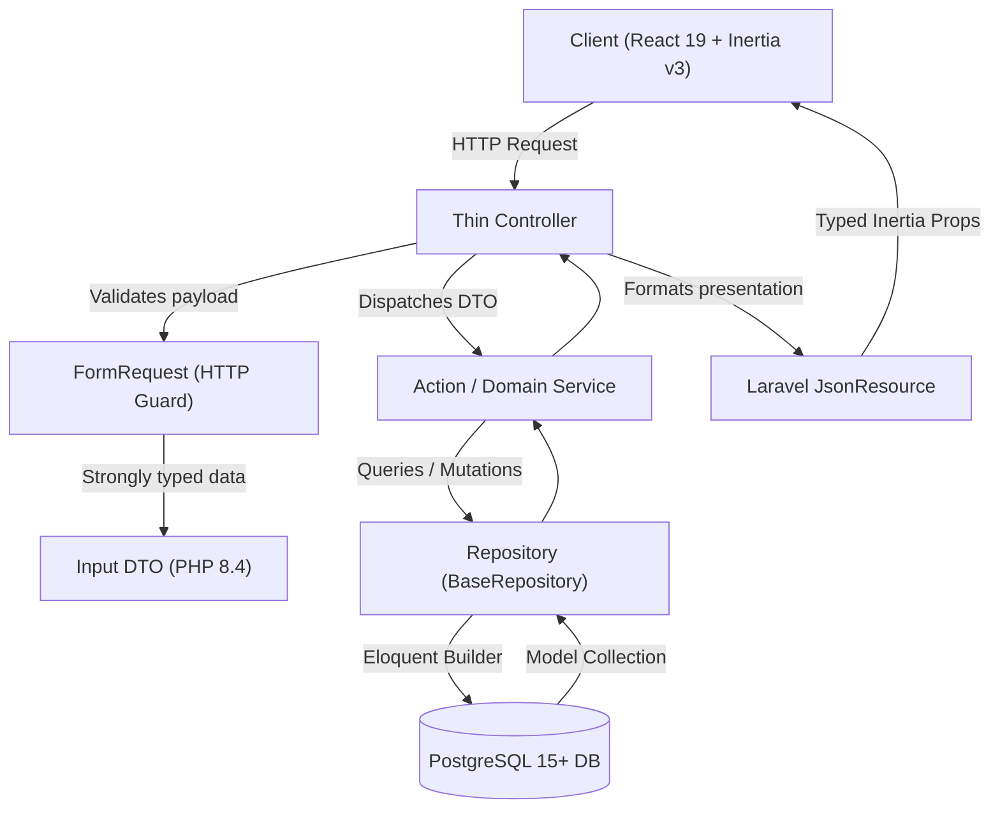
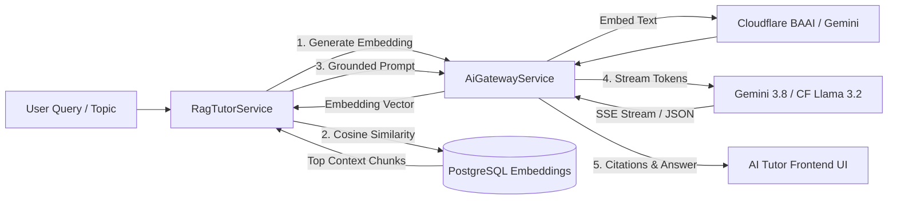

# Hiraya Review — Civil Service Exam Reviewer & AI Study Platform

<div align="center">

[](https://laravel.com)
[](https://php.net)
[](https://react.dev)
[](https://inertiajs.com)
[](https://www.typescriptlang.org)
[](https://tailwindcss.com)
[](https://www.postgresql.org)
[](#-automated-tests--code-quality)

<p align="center">
  <strong>An intelligent, full-stack edtech platform empowering Philippine Civil Service Examination (CSE) examinees with real-time RAG AI tutoring, predictive diagnostics, timed mock exams, and adaptive study schedules.</strong>
</p>

[Product Overview](#-product-overview) • [Engineering Highlights](#-engineering-highlights) • [System Architecture](#-system-architecture) • [Features](#-features-deep-dive) • [Tech Stack](#-technology-stack) • [AI Reference](#-ai-assistant--agent-context-card) • [Local Setup](#-local-development-setup) • [Author](#-author--contact)

</div>

---

## 📌 Executive Summary & Problem Statement

Every year, over **300,000+ Filipinos** take the nationwide Civil Service Examination (CSE) for career eligibility in government service. Traditionally, examinees rely on:

- ❌ **Outdated physical reviewer books** that lack interactive feedback.
- ❌ **Static PDF question dumps** with questionable answer keys and no pedagogical explanations.
- ❌ **Generic scoring** that fails to pinpoint specific subcategory weaknesses.

**Hiraya Review** solves this with an adaptive, full-stack modern web platform built from the ground up to provide **free, personalized, high-yield preparation**. Combining timed 170-item exam simulations, an interactive **24/7 RAG AI Exam Tutor**, procedural SVG problem generators, and predictive readiness analytics, it transforms preparation into a data-driven mastery journey.

> 💡 **Current Platform Status:** Hiraya Review is currently **100% Free** for all examinees. All core features—including AI tutoring, unlimited mock exams, smart weakness drills, and diagnostic plans—are fully unlocked with zero paywalls.

---

## 🚀 Engineering Highlights (Portfolio Showcase)

Here are the key technical challenges and architectural highlights engineered into this project:

- 🧠 **Dual-Provider AI Gateway & Sub-Second RAG Tutoring:** Implemented a unified AI gateway (`AiGatewayService`) routing across **Google Gemini** (`gemini-3.8-flash`, `gemini-3.7-flash`, `gemini-2.5-flash`) and **Cloudflare Workers AI** (`llama-3.2-3b`, `llama-3.1-8b`, `llama-3.3-70b`). Features Server-Sent Events (SSE) token streaming, PostgreSQL vector embeddings (`DocumentEmbedding`), cosine similarity retrieval, and automatic syllabus citation generation.
- 📐 **Layered Backend Architecture (Action-Repository-DTO + JsonResource):** Replaced controller bloat with a strict, testable 5-layer pipeline adhering to Single Responsibility and Open/Closed principles. FormRequests guard HTTP input, PHP 8.4 Input DTOs guarantee strong typing, single Actions encapsulate domain logic, and Repositories isolate queries and caching.
- ⚡ **Full Monolithic SPA with Inertia.js v3 & React 19:** Leveraged the newest Inertia v3 capabilities (instant visits, hover prefetching, standalone HTTP requests, deferred props) and React 19 with React Compiler for instant transitions and zero client-server API glue code.
- 🎨 **Procedural SVG Visual Generation:** Engineered custom AI prompt rules that synthesize valid, self-contained SVG graphics for Abstract Reasoning (rotations, fold matrices, analogies) and Data Interpretation charts directly inside exam items.
- 🛡️ **Defense-in-Depth & Modern Security:** Built with Laravel Fortify supporting **WebAuthn / Passkeys** and 2FA, Cloudflare Turnstile invisible bot defense, Cloudflare Workers AI content moderation, DOMPurify SVG sanitization, and tiered rate-limiting buckets.
- ✅ **100% Programmatically Tested & Automated Quality:** Covered by **219 passing Pest PHP automated tests** (980+ assertions), Laravel Pint code formatting, strict TypeScript checks (`tsc --noEmit`), and continuous integration pipelines.
- 💳 **Production-Ready Payment Pipeline (Dev Sandbox):** Complete Xendit invoice checkout integration (GCash, Maya, cards, e-wallets, OTC), webhook verification, local payment simulator (`/dev/payments/{payment}/simulate`), and an admin financial metrics dashboard.

---

## 🏛️ System Architecture

### 1. Request Lifecycle Pipeline


```mermaid
flowchart TD
    Client["Client (React 19 + Inertia v3)"] -->|"HTTP Request"| Controller["Thin Controller"]
    Controller -->|"Validates payload"| FormRequest["FormRequest (HTTP Guard)"]
    FormRequest -->|"Strongly typed data"| DTO["Input DTO (PHP 8.4)"]
    Controller -->|"Dispatches DTO"| Action["Action / Domain Service"]
    Action -->|"Queries / Mutations"| Repo["Repository (BaseRepository)"]
    Repo -->|"Eloquent Builder"| DB[("PostgreSQL 15+ DB")]
    DB -->|"Model Collection"| Repo
    Repo --> Action
    Action --> Controller
    Controller -->|"Formats presentation"| JsonResource["Laravel JsonResource"]
    JsonResource -->|"Typed Inertia Props"| Client
```

### 2. Multi-Model AI & RAG Subsystem


```mermaid
flowchart LR
    UserQuery["User Query / Topic"] --> Tutor["RagTutorService"]
    Tutor -->|"1. Generate Embedding"| Gateway["AiGatewayService"]
    Gateway -->|"Embed Text"| VectorModel["Cloudflare BAAI / Gemini"]
    VectorModel --> Gateway
    Gateway -->|"Embedding Vector"| Tutor
    Tutor -->|"2. Cosine Similarity"| PgVector[("PostgreSQL Embeddings")]
    PgVector -->|"Top Context Chunks"| Tutor
    Tutor -->|"3. Grounded Prompt"| Gateway
    Gateway -->|"4. Stream Tokens"| LLM["Gemini 3.8 / CF Llama 3.2"]
    LLM -->|"SSE Stream / JSON"| Gateway
    Gateway -->|"5. Citations & Answer"| ReactClient["AI Tutor Frontend UI"]
```

---

## 🌟 Features Deep Dive

### 1. 24/7 AI Exam Tutor (`/tutor`)

- **Conversational RAG Grounding:** Answers open-ended questions grounded directly in the official Civil Service Commission syllabus notes.
- **Interactive Question Checkpoints Rail:** A responsive timeline tracking all questions asked during a study session with jump-to-message navigation, scroll controls, mobile drawer support, and persistent state.
- **Syllabus Prompt Starters & Follow-Up Actions:** One-tap topic prompts per CSE category, accompanied by follow-up action chips (_"Another Worked Example"_, _"Common Traps"_, _"Memory Mnemonics"_).
- **Clickable Syllabus Citations:** AI responses automatically reference official curriculum modules, providing direct links to `/learn/{slug}`.
- **Low-Latency Streaming:** Token delivery via Server-Sent Events (SSE).

### 2. Dual-Track Full Mock Exams (`/exams`)

- **Professional Track:** 170 items, 3 hours and 10 minutes.
- **Subprofessional Track:** 165 items, 2 hours and 40 minutes.
- **Official Timers & Auto-Submission:** Real-time countdown clock with client-side persistence and auto-submission on expiration.
- **Interactive Navigation Palette:** Overview grid displaying answered, flagged, and unanswered items with instant jump navigation.
- **Diagnostic Review:** Detailed post-exam review with correct answers, full rationales, and sanitized SVG diagrams.

### 3. In-Exam & Post-Exam AI Question Explanations

- Instant step-by-step reasoning modal triggered directly from any exam item (`exams/questions/{question}/ai-explain`).
- Powered by `RagExplanationService` to decipher tricky distractor options and math formulas.
- Cached in the database (`question_ai_explanations`) to prevent redundant LLM latency and cost.

### 4. Smart Weakness Drills & Saved Sets (`/drills`)

- **Smart Weakness Generator:** 1-click drill creation that inspects historical attempt data and compiles questions from the student's lowest-performing subcategories.
- **Focused Category Drills:** Customizable practice sessions across General Information, Verbal Ability, Analytical Ability, Numerical Ability, and Clerical Ability.
- **Saved Drill Sets & Custom Questions:** Bookmark difficult items and author custom practice questions.

### 5. Predictive AI Diagnostics & Analytics (`/analytics`)

- **Statistical Pass Probability:** Computes the mathematical likelihood of passing the official exam based on weighted historical performance.
- **Subject Mastery Classification:** Segregates subcategories into _Mastered_, _Needs Practice_, and _Critical Concern_.
- **Estimated Readiness Timeline:** Forecasts the days needed to reach an 80%+ passing score.
- **Personalized 7-Day Remediation Plan:** Generates actionable daily tasks linked to weak topics and specific Learn Modules.

### 6. Interactive Learn Modules (`/learn`)

- Curated lessons designed around a **5-Step Pedagogical Model**:
    1. Core Concepts
    2. Key Rules & Formulae
    3. Mental Shortcuts & Mnemonics
    4. Real-World Exam Scenarios
    5. Check Your Understanding (interactive self-assessment MCQs with instant feedback)
- Public study catalog with automatic dynamic XML sitemap generation (`/sitemap.xml`).
- Lesson completion checklists and timestamp tracking.

### 7. Interactive Study Calendar (`/study-schedules`)

- Visual drag-and-drop calendar supporting month, week, and day views.
- Bulk operations: _"Reschedule Overdue Tasks to Today"_, time shifting, and completion toggles.
- Structured 30-day and 60-day review roadmap templates.

### 8. Dynamic View Access Management (`/admin/view-management`)

- Granular database-driven view permission matrix (`RolePermission`).
- Dynamically gate or expose application modules (e.g., AI Tutor, Billing, Analytics, CMS) per user role without code redeployments.

### 9. Billing & Payments System (Dev Sandbox Mode)

- Complete Xendit payment checkout infrastructure for Philippine payment methods (GCash, Maya, cards, e-wallets, OTC).
- Webhook processing with verification token validation (`/webhooks/xendit`).
- Local developer simulator (`POST /dev/payments/{payment}/simulate`) for zero-friction sandbox testing.
- Admin financial analytics dashboard tracking gross volume, platform fees, VAT, and conversion rates.

---

## 🛠️ Technology Stack

| Layer                         | Technologies & Tools                                                                                                                                                                 |
| ----------------------------- | ------------------------------------------------------------------------------------------------------------------------------------------------------------------------------------ |
| **Backend Framework**         | PHP 8.4, Laravel 13, Inertia.js v3 (Server), Laravel Fortify v1, Laravel Socialite v5, Laravel Wayfinder v0                                                                          |
| **Frontend Framework**        | React 19, TypeScript 5.7, Inertia.js v3 (Client), React Compiler, Vite 6                                                                                                             |
| **UI & Styling**              | Tailwind CSS v4, shadcn/ui + Radix UI (30+ primitives), Lucide React, Recharts 3.8, Sonner                                                                                           |
| **Database & Vector Storage** | PostgreSQL 15+ (Neon / Supabase / Local), strict Eloquent models, `DocumentEmbedding` cosine similarity vectors                                                                      |
| **AI Inference & LLMs**       | Google Gemini (`gemini-3.8-flash`, `gemini-3.7-flash`, `gemini-2.5-flash`), Cloudflare Workers AI (`llama-3.2-3b`, `llama-3.1-8b`, `llama-3.3-70b`), Cloudflare AI Gateway, Groq API |
| **Real-Time WebSockets**      | Pusher WebSockets + Laravel Echo                                                                                                                                                     |
| **Security & Moderation**     | Cloudflare Turnstile, Cloudflare Workers AI Profanity Moderation, DOMPurify, Passkeys / WebAuthn, Fortify 2FA                                                                        |
| **Payments (Dev Sandbox)**    | Xendit Payments Gateway (GCash, Maya, Cards, E-Wallets), Webhook verification, Dev Payment Simulator                                                                                 |
| **Testing & CI/CD**           | Pest PHP v4, Laravel Pint, ESLint, Prettier, GitHub Actions                                                                                                                          |
| **Containerization**          | Docker (`serversideup/php:8.4-fpm-nginx`)                                                                                                                                            |

---

## 🤖 AI Assistant & Agent Context Card

When collaborating or generating code on this repository, **strictly adhere to these project invariants**:

### Architecture & Placement Rules

1. **Frontend Lowercase Rule:** All directory and file names inside `resources/js/` must be **strictly lowercase** (e.g. `pages/user/tutor/index.tsx`, `components/domain/admin-table.tsx`).
2. **Role-Based Colocation:**
    - Public: `resources/js/pages/public/{module}/index.tsx`
    - User: `resources/js/pages/user/{module}/index.tsx`
    - Admin: `resources/js/pages/admin/{module}/index.tsx`
3. **Component Hierarchy:**
    - `components/ui/` ➔ Shadcn primitives only (CLI managed).
    - `components/layout/` ➔ App shell, header, sidebar, navigation wrappers.
    - `components/domain/` ➔ Reusable business components shared across 2+ distinct modules.
    - `pages/{role}/{module}/components/` ➔ Private components used exclusively within that module.
4. **Backend Mirroring:** Controller namespaces strictly mirror the frontend folder structure in PascalCase:
    - `app/Http/Controllers/Public/{Module}Controller.php`
    - `app/Http/Controllers/User/{Module}Controller.php`
    - `app/Http/Controllers/Admin/{Module}Controller.php`
5. **Validation & Strictness:**
    - Always use dedicated **FormRequests**; never use inline `$request->validate()` in controllers.
    - Always declare `declare(strict_types=1);` in PHP files.
    - Explicitly define `#[Fillable([...])]` on all Eloquent models.
    - Eager-load relations via `with()` or `load()` to prevent N+1 queries.
    - Format all PHP modifications with `vendor/bin/pint --dirty --format agent`.

### Core Routes & Domain Map

| URI                               | Route Name                    | Controller Action                            | Description                                 |
| --------------------------------- | ----------------------------- | -------------------------------------------- | ------------------------------------------- |
| `/tutor`                          | `tutor.index`                 | `User\AiTutorController@index`               | AI Tutor Chat Interface                     |
| `/tutor/ask` \| `/ai-tutor/ask`   | `tutor.ask`                   | `User\AiTutorController@ask`                 | RAG Tutor endpoint (JSON or SSE stream)     |
| `/exams`                          | `exams.index`                 | `User\ExamController@index`                  | Full mock exams dashboard & test engine     |
| `/exams/questions/{q}/ai-explain` | `exams.questions.aiExplain`   | `User\QuestionExplanationController@explain` | In-exam RAG AI question explanation         |
| `/drills`                         | `drills.index`                | `User\DrillController@index`                 | Category & customized practice drills       |
| `/drills/smart-weakness`          | `drills.smartWeakness`        | `User\DrillController@smartWeakness`         | Algorithmic weak-topic drill generator      |
| `/learn` & `/learn/{slug}`        | `learn.index` / `learn.show`  | `User\LearnController`                       | Interactive curriculum study modules        |
| `/analytics`                      | `analytics.index`             | `User\AnalyticsController@index`             | Predictive mastery analytics & radar charts |
| `/study-schedules`                | `study-schedules.index`       | `User\StudyScheduleController@index`         | Drag-and-drop study calendar planner        |
| `/admin/view-management`          | `admin.view-management.index` | `Admin\ViewManagementController@index`       | Dynamic view permission matrix manager      |
| `/admin/payments`                 | `admin.payments.index`        | `Admin\PaymentController@index`              | Financial metrics & payment management      |

---

## 💻 Local Development Setup

### 1. Prerequisites

- **PHP 8.4+** (`pdo_pgsql`, `mbstring`, `bcmath`, `fileinfo`, `gd`, `zip`, `intl`)
- **Composer 2.x**
- **Node.js 20+ & npm**
- **PostgreSQL 15+**

### 2. Installation

```bash
# Clone the repository
git clone https://github.com/codebykenth/hiraya-review.git
cd hiraya-review

# Install dependencies and prepare environment
composer install
npm install
cp .env.example .env

# Generate application encryption key
php artisan key:generate
```

### 3. Environment Configuration (`.env`)

```env
# Application
APP_NAME="Hiraya Review"
APP_ENV=local
APP_URL=http://localhost:8000

# PostgreSQL Database
DB_CONNECTION=pgsql
DB_HOST=127.0.0.1
DB_PORT=5432
DB_DATABASE=cse_reviewer
DB_USERNAME=postgres
DB_PASSWORD=your_password

# AI Inference (Gemini & Cloudflare)
GEMINI_API_KEY=your_gemini_api_key
GROQ_API_KEY=your_groq_api_key
CLOUDFLARE_ACCOUNT_ID=your_cloudflare_account_id
CLOUDFLARE_API_TOKEN=your_cloudflare_api_token
CLOUDFLARE_AI_GATEWAY_ID=your_ai_gateway_id

# Real-Time WebSockets
BROADCAST_CONNECTION=pusher
PUSHER_APP_ID="your_pusher_app_id"
PUSHER_APP_KEY="your_pusher_app_key"
PUSHER_APP_SECRET="your_pusher_app_secret"
PUSHER_APP_CLUSTER="ap1"
VITE_PUSHER_APP_KEY="${PUSHER_APP_KEY}"
VITE_PUSHER_APP_CLUSTER="${PUSHER_APP_CLUSTER}"

# Bot Defense
TURNSTILE_SITE_KEY=your_site_key
TURNSTILE_SECRET_KEY=your_secret_key
```

### 4. Database Setup & Seeding

```bash
# Run migrations and seed official CSC categories & subcategories
php artisan migrate:fresh --seed
```

### 5. Running the Development Stack

```bash
composer run dev
```

Starts the Laravel server (`http://127.0.0.1:8000`), the queue worker (`queue:listen`), and Vite with Hot Module Replacement concurrently.

---

## 🧪 Automated Tests & Code Quality

```bash
# Run the complete test suite (Pest PHP)
php artisan test --compact

# Run a specific domain or feature test
php artisan test --compact --filter=AiTutorTest

# Format PHP code to project standards (Laravel Pint)
vendor/bin/pint --dirty --format agent

# Run frontend linting and TypeScript checks
npm run lint
npm run types:check
npm run format

# Full CI Verification
composer ci:check
```

---

## 🐳 Docker Deployment

The project includes a production Docker setup based on `serversideup/php:8.4-fpm-nginx`:

```bash
# Build the production container image
docker build -t hiraya-review .

# Run the container
docker run -p 8080:8080 --env-file .env hiraya-review
```

- **Multi-Stage Assets:** Pre-compiles frontend assets with Vite and strips development dependencies.
- **Automated Entrypoint (`scripts/00-laravel-deploy.sh`):** Handles `config:cache`, `route:cache`, `view:cache`, and `migrate --force` automatically upon container startup.

---

## 👤 Author & Contact

**Kenth**  
Full-Stack Software Engineer & AI Systems Developer

- **GitHub:** [@codebykenth](https://github.com/codebykenth)
- **Repository:** [hiraya-review](https://github.com/codebykenth/hiraya-review)

---

<div align="center">
  <sub>Built with care to empower the next generation of Philippine civil servants. 🇵🇭</sub>
</div>
